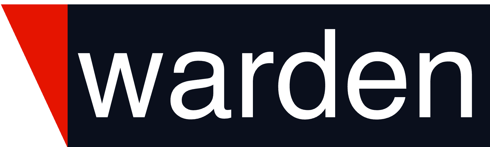

# Warden

Warden eliminates cloud credentials and enforces Zero Trust for every cloud API call and database access. It acts as an authorization proxy for humans, machines, and AI, ensuring least privilege, safe operations, and complete visibility.

The key features of Warden are:

* **Workload Identity**: Warden gives every workload a verifiable, first-class identity. Instead of relying on static credentials, workloads authenticate to Warden using their native identity (e.g., GitHub Actions, GitLab, Kubernetes, Terraform runners). Warden then issues ephemeral credentials that carry that identity with them.
This means that whenever those credentials are used (by Terraform, CI jobs, or applications) Warden can always determine exactly which workload identity is behind the request. No ambiguity, no shared keys, no blind spots.

* **Secretless Access**: With Warden workloads no longer store or manage secrets. Instead, the request goes through Warden, which generates short-lived credentials on demand and injects them in the request before forwarding it to the provider. No long-lived tokens, no static keys, no secret sprawl.

* **Just-In-Time Access**: Credentials are created only when needed and remain valid only for the duration of the operation. Access is granted dynamically based on workload identity and policy, never pre-provisioned or permanently assigned.

* **Unified Access Policy**: A single, consistent policy layer defines who (identity) can access what (cloud provider, database, resource) under which conditions. This replaces scattered, provider-specific access rules with one unified model.

* **Full Audit Visibility**: Every identity verification, credential issuance, and downstream action performed with Warden-issued credentials is logged. This provides end-to-end traceability, making it clear which workload did what, where, and when.

## Warden in the Security Ecosystem
