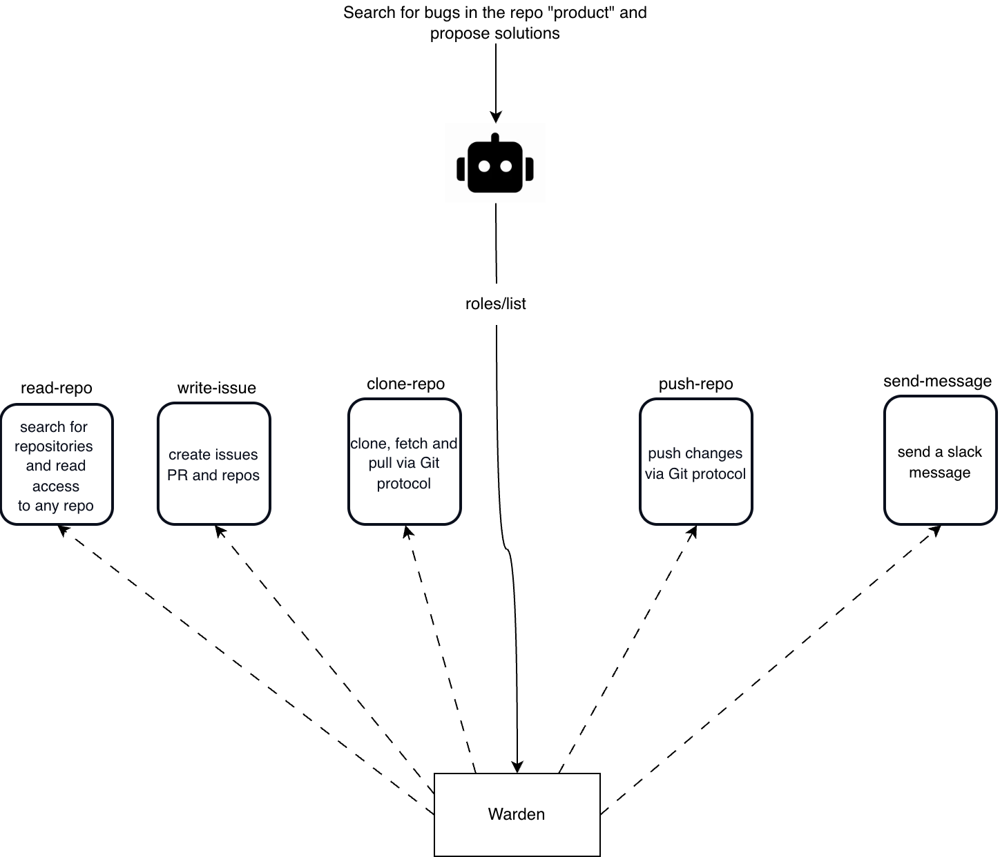
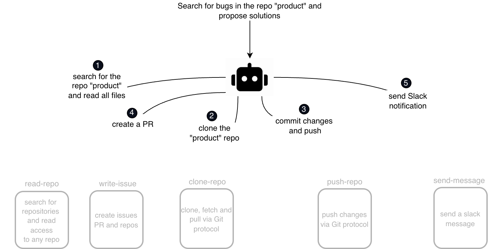
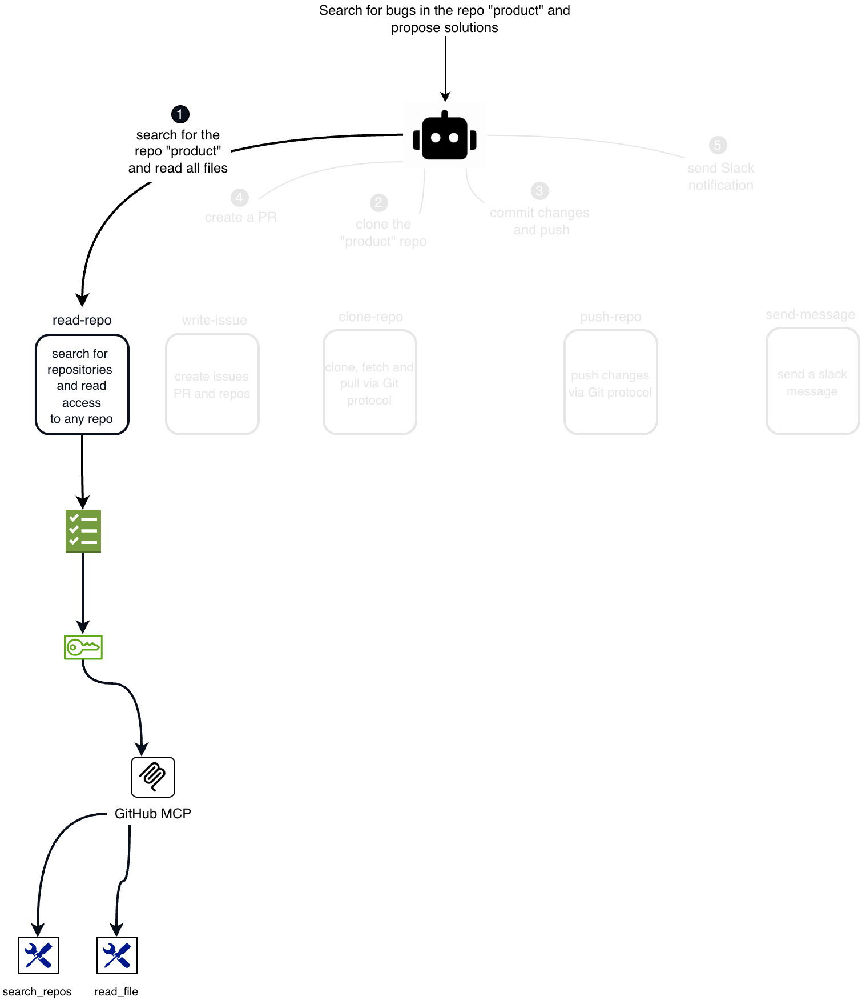
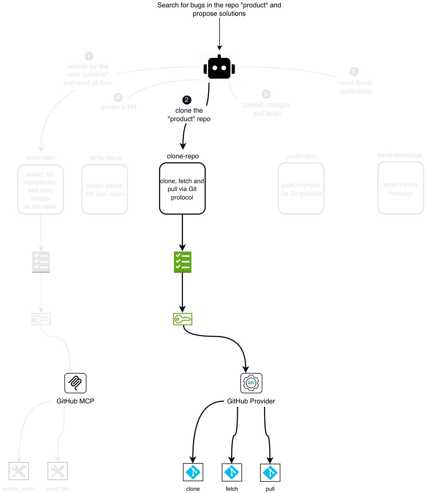
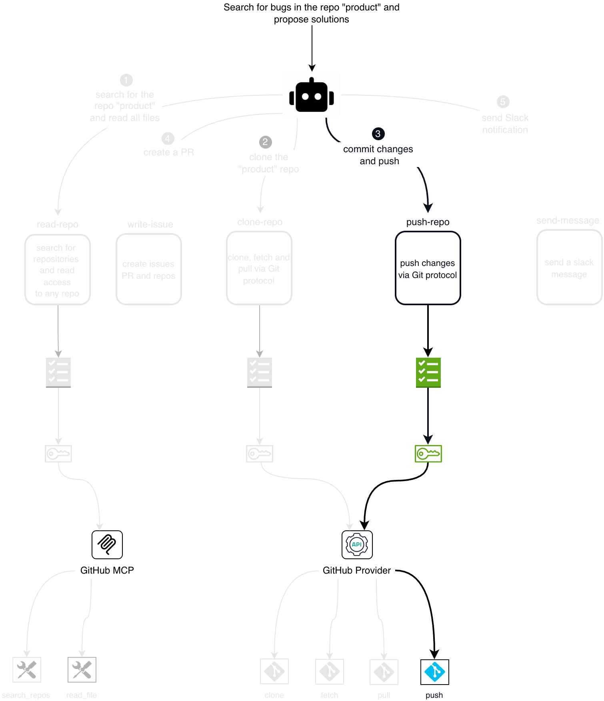
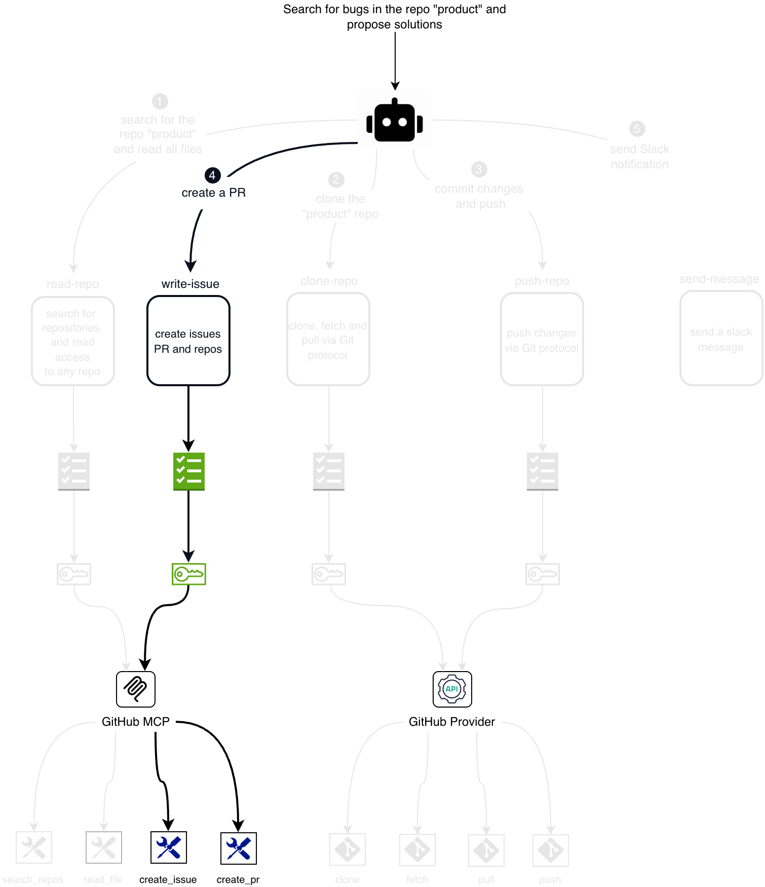
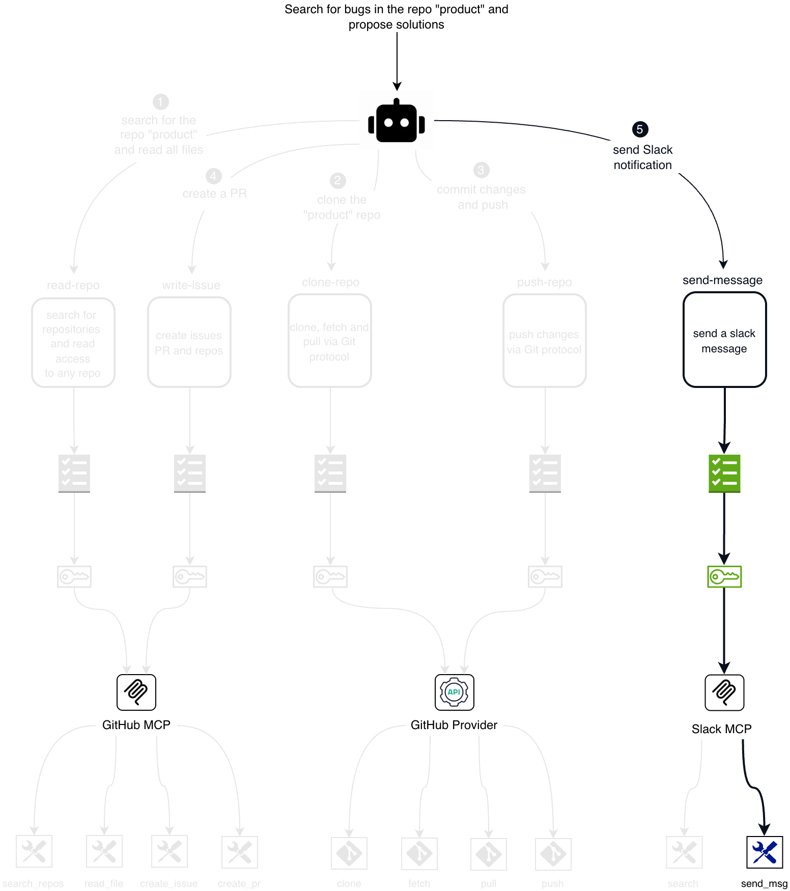

# Roles

A **role** is a named, reusable definition — set once by an operator on an
[auth method](authentication.md#auth-methods) — that projects a specific slice
of capability onto a caller. The closest analogy is a **database view**: it
stores no authority of its own and holds no data. It is a saved definition that
Warden **resolves on each request** into a concrete grant — *who may assume it*
(the identity binding), *what it may do* (its [policies](policies.md)), and
*what credential it is handed* (the [credential spec](credentials.md) Warden
mints). And just as many views can sit over the same tables, each exposing a
different subset of columns and rows, many roles can sit over the same provider backend,
each exposing a different subset of its actions.

This is what lets one workload hold a single identity credential yet act with **least
privilege**: it borrows exactly the authority of whichever role it names for the
task at hand, and nothing more.

## A Role Is a View Over Your Infrastructure

Calling a role "an identity" is the common shorthand, but it's misleading: an
identity is something you *hold*, whereas a role holds nothing — like a database
view, it is resolved fresh on every request. That is why the view analogy fits
better, and it is worth making precise:

| A database view… | A Warden role… |
|------------------|----------------|
| is a **named, saved definition**, not a copy of data | is a named, saved definition, not a standing identity |
| **holds no data** — it resolves against the base tables on each query | **holds no authority** — it resolves against policies and credentials **on each request** |
| exposes **only the columns and rows it selects** | exposes **only the actions its policy allows** |
| carries **its own permissions**, independent of the tables | carries **its own policies**, independent of the provider |
| lets **many views** sit over the same tables, each a different slice | lets **many roles** sit over the same provider, each a different slice |

The projection point is the one to internalize: **just as a view exposes only
the columns it selects, a role's `tools/list` exposes only the tools its policy
allows.** A provider's other tools are hidden from the caller exactly the way a
view hides the columns it didn't select — they are not merely blocked, they are
absent from what the caller can see.

The analogy stretches in one place, and it's worth naming: a role does *more*
than a view. It also decides **who matches** (the identity binding) and it
**mints a scoped credential** for the caller. A view only projects; a role
projects, admits, and equips.

## One Goal, Many Roles

Consider an AI agent handed a single instruction: *"Search for bugs in the repo
'product' and propose solutions."* No one hands the agent five credentials. It
holds one identity, and to get anything done it works in two moves: first find
out what it is allowed to do, then decompose the goal into steps that fit.

### Discovery: what roles can I assume?

The agent doesn't need to know the role names in advance. It asks Warden which
roles its identity can assume and reads each role's **description** to choose the
right one for a step — the same introspection you get from `warden role list`.

<p align="center"></p>

### Planning: one role per step

With the menu in hand, the agent decomposes the goal into concrete subtasks and
maps each to the role that fits it — a read step to `read-repo`, a push step to
`push-repo`, and so on. Each step will name its own role.

<p align="center"></p>

### Step 1 — what a role unlocks

When the agent picks the role for its first step — *search the repo and read its
files* — that role, `read-repo`, resolves top-to-bottom into a complete,
authorized path: the **policy** attached to the role decides what is allowed, the
**credential** Warden mints is injected upstream, the request reaches the
**provider** (here, GitHub over MCP), and the provider exposes exactly the
**tools** the policy permits.

<p align="center"></p>

> **When an agent presents a role and calls `tools/list`, Warden returns only
> the tools the policy attached to that role allows — every other tool the
> provider offers is invisible.**

Make that concrete: the agent's opening move under `read-repo` is a `tools/list`
call, and Warden answers with exactly `search_repos` and `read_file` — not
`create_pr`, not `delete_repo`, nothing else — because the policy on `read-repo`
allows only those two. The list the agent sees *is* the role's policy, projected.

### Steps 2–5 — discover, then act

Every step begins the same way: under its new role, the agent **first discovers
what it may do — and gets back only the tools that role allows** — then acts. On
an MCP provider that discovery is a `tools/list` call.

**Step 2** clones the repo through `clone-repo`, reaching the **GitHub Provider**
(Git over HTTP). Under this role the provider offers only `clone`, `fetch`, and
`pull`:

<p align="center"></p>

**Step 3** commits and pushes through `push-repo` — the *same* GitHub Provider,
which now offers this role only `push`:

<p align="center"></p>

**Step 4** opens a pull request through `write-issue`, back on the *same* GitHub
MCP mount as step 1. The agent runs `tools/list` again — and this time it returns
only `create_issue` and `create_pr`, none of the read tools it saw in step 1:

<p align="center"></p>

**Step 5** posts the result to Slack through `send-message`, reaching **Slack
MCP**. Its `tools/list` returns a single tool — `send_msg` — and nothing else:

<p align="center"></p>

Two lessons stand out. **The same provider backs different roles with different
access:** `read-repo` and `write-issue` both reach GitHub MCP yet see different
tools; `clone-repo` and `push-repo` both reach the GitHub Provider yet unlock
different Git operations. And **the role, not the route, decides authority** —
nothing about the endpoint fixes what a caller may do with it; the role names the
slice.

Across the whole goal, one agent moves through five roles, each a self-contained
path from task to tool:

| Step | Role | What the policy grants | Provider | Tools/actions it exposes |
|------|------|------------------------|----------|--------------------------|
| 1 · search & read the repo | `read-repo` | search repos, read any repo | GitHub MCP | `search_repos`, `read_file` |
| 2 · clone the repo | `clone-repo` | clone/fetch/pull via Git | GitHub Provider | `clone`, `fetch`, `pull` |
| 3 · commit & push | `push-repo` | push via Git | GitHub Provider | `push` |
| 4 · create a PR | `write-issue` | create issues, PRs, repos | GitHub MCP | `create_issue`, `create_pr` |
| 5 · notify Slack | `send-message` | send a Slack message | Slack MCP | `send_msg` |

## Why Roles Matter for an Agent

Scoping an agent to a **per-task role**, instead of one broad credential, is what
makes an autonomous agent both **safe** and **effective** to run. Several
benefits fall out of it directly.

**A smaller attack surface: the agent can only ever touch one task's worth of
your systems at a time.** Each request carries exactly one role's authority — one
narrow slice, never the union of everything the workload could do. And because
`tools/list` under a role returns only the tools that role's policy allows,
`read-repo` sees exactly `search_repos`/`read_file` and the rest of GitHub MCP's
surface simply does not exist for it. The agent's reachable surface *is* the
role's policy — nothing wider is ever presented to it.

**A compromise can't spread: breaking the agent during one step gives an
attacker nothing but that step.** Roles share no policies and no credentials, and
the credential Warden mints is scoped to the role's task. A step hijacked while
holding `read-repo` cannot pivot to `push` or to Slack — those are different
roles the agent must explicitly name, each one re-authorized by Warden on its own
request. The five paths in the worked example above are exactly that: five
separate, isolated routes from one agent, sharing no authority. There is no
ambient, pre-granted authority sitting on the connection waiting to be reused, so
there is nothing to move laterally *into*.

**A hallucinated — or injected — action can't do damage: the model can't call
what its role doesn't grant.** Because `tools/list` is filtered to the role's
allowed set, a destructive tool the model might invent — `delete_repo`, say — or
that a **prompt-injection** attack tries to coax it into calling, never appears
in its menu; and if it calls one by name anyway, the `tools/call` is denied at
the boundary. The guardrail lives at the boundary, not in the prompt, so it holds
even when the model is confused or deliberately misled. See [MCP](mcp.md) for how
that per-tool filtering and enforcement works.

**Less context bloat, and sharper tool choice: the model sees only the handful
of tools the task needs.** An unfiltered `tools/list` pours a provider's entire
catalogue — every tool's name, description, and JSON schema — into the model's
context window, burning tokens and burying the few relevant tools among dozens
that aren't. Filtering the list to the role's allowed tools keeps the context
lean: lower token cost and latency, and a model that reliably picks the right
tool because there are only a few and every one of them is relevant. Under
`read-repo` the model weighs two tools, not GitHub's full surface — the classic
"too many tools" failure mode simply doesn't arise.

**Every action is attributable to the task that took it.** Each request runs
under exactly one named role, and Warden stamps the issued token — and the
[audit log](audit.md) — with that role. Because a step's role maps one-to-one to
a subtask, the trail reads as a per-task ledger: which role searched the repo,
which pushed, which messaged Slack — each under its own scoped credential. When
something goes wrong, you know precisely which task did it and with what
authority.

## Roles Are Per-Request

Because a role is resolved on each request — like a view evaluated fresh on each
query — authority is never fixed onto a connection or a session.

**The role is supplied on every request.** For transparent callers there is no
login and no session in which a role is set once; the role travels with each
individual request (via the `X-Warden-Role` header, the request path, or a query
parameter — see [Selecting a Role](#selecting-a-role)). The role is a property of
the request, not of the connection.

**Authorization happens per request, at runtime.** Warden authorizes each request
independently against the role it names. Internally it derives a transparent
token's identifier by hashing *credential + mount + role* together, so a request
that names a different role resolves to a different token with different policies.

**Clients can change role mid-session.** The same workload, holding the same
credential, can present one role on one request and a different role on the next.
This is exactly what the worked example above relies on: an agent operates under a
least-privilege role for routine work and names a higher-privilege role only for
the specific step that genuinely needs it, narrowing the blast radius of any
single action without re-authenticating.

## Where Roles Live

Each auth method holds its own set of roles, addressed relative to the method's
mount path:

```
auth/<method>/role/<name>
```

Create and inspect them with the standard read/write commands:

```bash
# Create or update a role
warden write auth/jwt/role/read-repo \
  bound_audiences=api.example.com \
  token_policies=read-repo \
  cred_spec_name=github-src \
  description="search for repositories and read access to any repo" \
  token_ttl=5m

# Read, list, and delete
warden read   auth/jwt/role/read-repo
warden list   auth/jwt/role
warden delete auth/jwt/role/read-repo
```

To discover which roles the **caller's own identity** can assume — the
introspection the agent used above — use the role list command, which fans out
across every auth mount of the caller's credential type in the current namespace
and returns each role with its description:

```bash
warden role list
warden role list -auth-path auth/jwt/   # restrict to one mount
warden role list -o ndjson | jq -r .name
```

## Common Fields

Every role, regardless of auth method, shares the same grant fields:

| Field | Meaning |
|-------|---------|
| `token_policies` | The [policies](policies.md) attached to tokens issued for this role — the projection that decides what the role can do (and, for MCP mounts, which tools its `tools/list` returns). |
| `token_ttl` | Lifetime of issued tokens. Stored as a duration string (e.g. `1h`, `8h`); defaults to **1h** when unset. |
| `cred_spec_name` | Name of a [credential spec](credentials.md) the issued token is scoped to — what Warden mints for callers of this role. |
| `description` | Human-readable purpose of the role. **Surfaced through introspection** so an agent listing its roles can pick the right one for a task — as in the worked example above. |

> **`token_type` is not something you set.** Each auth method fixes the type of
> token its roles issue — `jwt_role`, `cert_role`, `kubernetes_role`, or
> `spiffe_role` — and the value is stamped automatically during role validation.
> See [Token Types](tokens.md#token-types).

## Binding Fields by Auth Method

The binding fields are what make a role specific to its auth method. They decide
which credentials match — the "who may assume it" half of the definition.

### JWT

| Field | Meaning |
|-------|---------|
| `bound_audiences` | `aud` claim values the JWT must carry. |
| `bound_subject` | Exact `sub` claim that must match. |
| `bound_claims` | Map of arbitrary claims that must all match. |
| `user_claim` | Claim used as the principal identity (default `sub`). |
| `groups_claim` | Claim holding group names, for dynamic group→policy mapping. |
| `group_policy_prefix` | Prefix prepended to each group name to form a policy name. |
| `max_age` | Rejects JWTs whose `iat` is older than this (e.g. `30m`), guarding against stale-token replay. |

### Certificate

| Field | Meaning |
|-------|---------|
| `allowed_common_names` | Glob patterns for the certificate CN. |
| `allowed_dns_sans` | Glob patterns for DNS SANs. |
| `allowed_email_sans` | Glob patterns for email SANs. |
| `allowed_uri_sans` | Segment-aware URI SAN patterns — `+` matches one segment, trailing `*` matches one or more (e.g. `spiffe://+/ns/*/sa/*`). |
| `allowed_organizational_units` | Allowed OUs. |
| `allowed_organizations` | Allowed organizations. |
| `certificate` | Role-specific trusted CA PEM, overriding the method's global CA. |
| `principal_claim` | Which field becomes the identity: `cn`, `dns_san`, `email_san`, `uri_san`, or `serial`. |

A certificate role must set **at least one** of the `allowed_*` constraints — a
role that would match any certificate is rejected at write time.

### Kubernetes

| Field | Meaning |
|-------|---------|
| `bound_service_account_names` | ServiceAccount names the workload must use. `*` matches any. |
| `bound_service_account_namespaces` | Namespaces the workload's ServiceAccount must live in. `*` matches any. |
| `audience` | Sent as `spec.audiences` in the TokenReview; the workload JWT must declare it or the kube-apiserver rejects the review. |
| `max_age` | Rejects ServiceAccount JWTs older than this. |

At least one of `bound_service_account_names` or
`bound_service_account_namespaces` must be a concrete value — both set to only
`*` is refused.

### SPIFFE

One SPIFFE role serves both SVID forms: an X.509-SVID (TLS client certificate)
or a JWT-SVID (bearer token).

| Field | Meaning |
|-------|---------|
| `trust_domain` | **Required.** The trust domain whose bundle the SVID must verify against. |
| `allowed_spiffe_ids` | Optional segment-aware SPIFFE ID patterns the verified SVID must match (e.g. `spiffe://example.org/ns/+/sa/*`). |
| `bound_audiences` | Audiences accepted for JWT-SVID logins. Ignored for X.509-SVIDs. |
| `groups_claim` | JWT-SVID claim holding group names for dynamic policy mapping. |
| `group_policy_prefix` | Prefix forming a policy name from each group (default `group-`). |

> **Note:** `bound_audiences` is optional at write time but required at JWT-SVID
> login. A role with no `bound_audiences` stays usable for X.509-SVIDs but
> rejects JWT-SVID logins **fail-closed** — writing such a role returns a warning
> to that effect.

## Selecting a Role

For an **explicit login**, the caller names the role directly.

For **transparent (implicit) authentication**, where the workload never logs in,
Warden resolves the role per request from the first of these that is present:

1. the `X-Warden-Role` header,
2. a role encoded in the request path — the canonical
   `<provider>/role/<role>/gateway/<api>` form — or a `role=` query parameter,
3. a provider-supplied default,
4. the auth method's **`default_role`**.

The `default_role` is set on the auth method's *config*, not on a role, and is
the fallback when a transparent caller supplies no role:

```bash
warden write auth/jwt/config default_role=workload
```

## Token TTL

A role's `token_ttl` caps, but does not extend, the life of an issued token. The
effective expiry is the **minimum** of the role's `token_ttl` and the lifetime of
the credential it was derived from (a JWT's `exp`, a certificate's validity
window). A token never outlives the credential that produced it.

There is no `max_ttl` field and tokens are **not renewable** — see
[Expiration and renewal](tokens.md#expiration-and-renewal). When a token expires,
an explicit caller logs in again; a transparent caller's next request re-mints one
automatically.

## See Also

- [Authentication](authentication.md) — how a credential is proven before a role
  is applied.
- [Policies](policies.md) — what a role grants.
- [MCP](mcp.md) — how a role's policy filters a provider's `tools/list` and gates
  each `tools/call`.
- [Providers](providers.md) — the upstreams a role reaches.
- [Tokens](tokens.md) — what a role issues.
- [Credentials](credentials.md) — what `cred_spec_name` points at.
- [Audit](audit.md) — where each action is recorded, stamped with its role.
- [Namespaces](namespaces.md) — the scope roles and their tokens live in.
