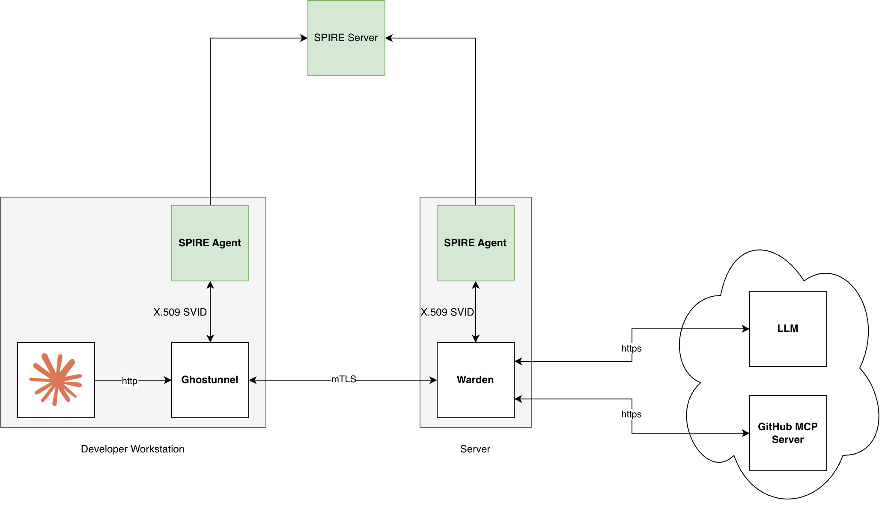

# 03 — SPIFFE → Warden → LLM + MCP (zero credentials)

**The capstone.** A keyless **SPIFFE X.509-SVID** is the workstation's only identity, and it
carries *both* Claude Code's model calls **and** a hosted MCP server (GitHub) through Warden. The
result: **no LLM key, no MCP token, no private key** on the laptop — yet the agent keeps its
model and its tools, and every call is policy-checked and audited under that identity at one
chokepoint.




| Credential | Removed by | On the workstation after 03 |
|------------|-----------|------------------------------|
| Anthropic API key | already gone (server-side) | **no** ✅ |
| GitHub MCP token | already gone (server-side) | **no** ✅ |
| Client private key | **this rung** — the SVID is keyless | **no** ✅ |

This rung is **self-contained** — it stands up its own stack. It folds in everything from
[01](../01-cert-llm/) and [02](../02-cert-llm-mcp/): Steps 1–5 stand up the keyless SPIFFE
identity (the new part), and Steps 6–8 put the LLM and the GitHub MCP server behind it exactly
as the earlier rungs did under a certificate.

> **Why containers (and why that's still secure).** SPIRE's workload attestors are Linux-only,
> so on macOS we run Warden + ghostunnel as **containers** attested by the SPIRE agent's
> **docker** attestor. The SVID's key is fetched over the Workload API into ghostunnel's memory
> and never touches disk; it rotates on a short TTL. Docker-label attestation is a legitimate
> attestation mechanism, not a shortcut.

---

## The problem — today, without Warden

Every credential the agent uses sits on the laptop: the LLM key in your environment, the MCP
token in the agent's config, and (if you used cert auth) a private key on disk.

```bash
echo "$ANTHROPIC_API_KEY"                      # sk-ant-...           (LLM key, in your env)
grep -i 'ghp_\|Bearer ' ~/.claude.json         # Authorization: Bearer ghp_...  (MCP token, on disk)
ls -l *.key 2>/dev/null                         # a private key, on disk
```

Each is the same three problems from the earlier rungs: it's **stored on the machine**, governed
by **no central policy**, and used with **no central audit**. This rung removes **all three**
secrets at once — nothing sensitive is left on the laptop, and the keyless SVID means not even
the identity material is on disk.

---

## The fix — one SVID, routing everything

### Prerequisites

```bash
docker compose version     # v2.23.1+ (for inline `configs:` content)
claude --version
```

Download the **Warden CLI** onto your `PATH` (swap `darwin_arm64` for `darwin_amd64` or `linux_*`):

```bash
VER=0.17.0
curl -fsSL "https://github.com/stephnangue/warden/releases/download/v${VER}/warden_${VER}_darwin_arm64.tar.gz" \
  | tar -xz warden && chmod +x warden
export PATH="$PWD:$PATH"
```

From this directory, stage the two upstream secrets — the Anthropic key in a file, and a GitHub
PAT (classic, `repo` + `read:org`) in your environment:

```bash
cd docs/examples/workstation/03-spiffe-llm-mcp
printf '%s' 'sk-ant-...' > anthropic-key.txt && chmod 600 anthropic-key.txt
export GH_PAT=ghp_...
alias sps='docker compose exec spire-server /opt/spire/bin/spire-server'   # SPIRE CLI helper
```

### Step 1 — start SPIRE and bootstrap the agent

```bash
docker compose up -d spire-server
docker compose logs spire-server          # "Built X.509 CA" / "Starting Server APIs"

export JOIN_TOKEN=$(docker compose exec -T spire-server \
  /opt/spire/bin/spire-server token generate -spiffeID spiffe://example.org/agent \
  | sed 's/^Token: //')
docker compose up -d spire-agent
docker compose logs spire-agent           # "Node attestation was successful"
```

> The join token is **single-use, 10-minute** TTL. If attestation later fails, re-run the
> `export JOIN_TOKEN=…` line for a fresh one.

### Step 2 — register the workload SVIDs (by container label)

```bash
sps entry create -parentID spiffe://example.org/agent \
  -spiffeID spiffe://example.org/warden \
  -selector docker:label:org.example.spiffe:warden -x509SVIDTTL 60

sps entry create -parentID spiffe://example.org/agent \
  -spiffeID spiffe://example.org/ghostunnel \
  -selector docker:label:org.example.spiffe:ghostunnel -x509SVIDTTL 60

sps entry show
```

Register these **before** starting Warden — it fails closed without an available SVID.

### Step 3 — start Warden + ghostunnel

```bash
docker compose up -d warden ghostunnel
docker compose logs warden       # "starting HTTPS server address=127.0.0.1:8400"
docker compose logs ghostunnel   # "using SPIFFE Workload API as certificate source"
curl -s http://127.0.0.1:8200/v1/sys/health    # 200 ⇒ mTLS via SVID works end-to-end
```

### Step 4 — point the admin CLI at Warden (through ghostunnel)

The CLI reaches Warden's SPIFFE-only listener through ghostunnel's plaintext port (`:8200`):

```bash
export WARDEN_ADDR=http://127.0.0.1:8200
export WARDEN_TOKEN=root
warden status
```

### Step 5 — enable the SPIFFE auth method with federation

```bash
warden auth enable spiffe

docker compose exec -T spire-server /opt/spire/bin/spire-server bundle show -format pem > example.org-ca.pem

warden write auth/spiffe/trust-domain/example.org \
  bundle_endpoint_url="https://spire-server:8443" \
  bundle_endpoint_profile="https_spiffe" \
  endpoint_spiffe_id="spiffe://example.org/spire/server" \
  bundle_pem=@example.org-ca.pem

warden read auth/spiffe/trust-domain/example.org    # x509_authority_count > 0, empty last_error
```

### Step 6 — route the Anthropic API (LLM)

```bash
warden provider enable -path=anthropic -description="Anthropic API (inference)" anthropic

warden write anthropic/config <<'EOF'
{ "anthropic_url": "https://api.anthropic.com", "auto_auth_path": "auth/spiffe/", "timeout": "120s", "max_body_size": 10485760 }
EOF

warden cred source create anthropic-src -type=apikey -rotation-period=0 \
  -config=api_url=https://api.anthropic.com \
  -config=verify_endpoint=/v1/models \
  -config=auth_header_type=custom_header \
  -config=auth_header_name=x-api-key \
  -config=extra_headers=anthropic-version:2023-06-01 \
  -config=display_name=Anthropic

warden cred spec create anthropic-ops -source anthropic-src -config api_key=@anthropic-key.txt

warden policy write anthropic-access - <<'EOF'
path "anthropic/role/+/gateway*" { capabilities = ["create", "read", "update", "delete", "patch"] }
EOF

warden write auth/spiffe/role/anthropic \
  trust_domain="example.org" \
  allowed_spiffe_ids="spiffe://example.org/ghostunnel" \
  token_policies="anthropic-access" cred_spec_name="anthropic-ops" token_ttl="1h"
```

### Step 7 — route GitHub's MCP server

```bash
warden provider enable -path=github-mcp -description="GitHub Copilot MCP" mcp

warden write github-mcp/config <<'EOF'
{ "mcp_url": "https://api.githubcopilot.com/mcp", "auto_auth_path": "auth/spiffe/", "timeout": "10m", "max_body_size": 10485760 }
EOF

warden cred source create github-src -type=github -rotation-period=0 \
  -config=github_url=https://api.github.com

warden cred spec create github-ops -source github-src -config auth_method=pat -config token=$GH_PAT

warden policy write mcp-github-access - <<'EOF'
path "github-mcp/role/+/gateway*" {
  capabilities = ["create", "read", "delete"]
  mcp { denied_tools = ["delete_*", "create_*", "update_*", "push_*", "merge_*", "fork_*"] }
}
EOF

warden write auth/spiffe/role/github \
  trust_domain="example.org" \
  allowed_spiffe_ids="spiffe://example.org/ghostunnel" \
  token_policies="mcp-github-access" cred_spec_name="github-ops" token_ttl="30m"
```

### Step 8 — drive Claude Code (both routed over the SVID)

Smoke-test each gateway through ghostunnel (no auth header — the SVID is the identity; GitHub
needs the **trailing slash**):

```bash
curl -sS http://127.0.0.1:8200/v1/anthropic/role/anthropic/gateway/v1/models | head

curl -sS http://127.0.0.1:8200/v1/github-mcp/role/github/gateway/ \
  -H "Content-Type: application/json" -H "Accept: application/json, text/event-stream" \
  -d '{"jsonrpc":"2.0","id":1,"method":"tools/list"}'
```

Then connect Claude Code — inference *and* tools, no secrets on the workstation:

```bash
claude mcp add --transport http github "http://127.0.0.1:8200/v1/github-mcp/role/github/gateway/"

claude mcp list      # github: ✓ Connected

export ANTHROPIC_BASE_URL="http://127.0.0.1:8200/v1/anthropic/role/anthropic/gateway"
export ANTHROPIC_API_KEY="placeholder"

claude -p "Using the github MCP server, list 3 of my repositories." \
  --allowedTools "mcp__github__*"
```

That prompt's **inference and tool call are both routed** over the same SVID.

### Step 9 — policy and audit, under the keyless identity

Everything 01 and 02 enforced still applies — but now the *subject* of every decision is the
SVID, not a cert CN. Turn on the audit log and watch:

```bash
warden audit enable file -file-path=/audit/audit.log

# second terminal
tail -f audit/audit.log | jq '{id: .auth.principal_id, role: .auth.role_name,
  allowed: .auth.policy_results.allowed, tool: .auth.policy_results.mcp_decision.name}'
```

Re-run Step 8's `tools/list`: the entry's `id` is `spiffe://example.org/ghostunnel` with
`allowed: true`. Then try a state-changing tool — the `denied_tools` rule from Step 7 blocks it
at Warden, before anything reaches GitHub:

```bash
curl -sS http://127.0.0.1:8200/v1/github-mcp/role/github/gateway/ \
  -H 'content-type: application/json' -H 'accept: application/json, text/event-stream' \
  -d '{"jsonrpc":"2.0","id":2,"method":"tools/call",
       "params":{"name":"delete_repository","arguments":{"owner":"me","repo":"demo"}}}'
# {"error":"insufficient_permissions","error_description":"Tool 'delete_repository' not allowed."}  (403)
```

The audit log now holds two decisions under the same keyless SVID — `allowed: true` for the read,
`allowed: false` for the blocked write. Zero credentials on disk, **and** every call
policy-checked and attributed to a rotating identity that never touched the workstation.

---

## Verify it worked — the zero-credential check

1. Both Step 8 curls succeed; the headless prompt returns repo data.
2. `claude mcp list` shows `github ✓ Connected` with **no token** in the config.
3. Walk the workstation and find nothing sensitive:

```bash
echo "${ANTHROPIC_API_KEY:-unset}"                 # placeholder or unset — no real key
grep -i 'ghp_\|Bearer ' ~/.claude.json || echo "no token in claude config"
ls *.key 2>/dev/null || echo "no private key on disk"
```

All three come back clean — there's nothing sensitive on the laptop to leak, scope, or
mis-audit. Every call Claude makes now carries the keyless SVID identity, is checked against
Warden's policy, and lands in one audit trail.

4. **Policy + audit (Step 9):** the read tool's audit entry shows
   `auth.principal_id = "spiffe://example.org/ghostunnel"` with `allowed:true`; the `delete_*`
   call returns `403 insufficient_permissions` and logs `allowed:false` — same keyless identity,
   no repository changed.

The workstation holds **zero long-lived credentials** — so even a fully cooperative (or fully
compromised) agent has nothing to hand over.

## Scorecard — the top of the ladder

| Credential | 01 | 02 | **03** |
|------------|:--:|:--:|:------:|
| LLM API key | ✅ | ✅ | ✅ |
| GitHub MCP token | on disk | ✅ | ✅ |
| Client private key | on disk | on disk | ✅ |

You climbed both axes — from a certificate-with-a-key to a keyless SVID, and from one secret
removed to all of them. Same Claude Code, same workflow; the laptop just stopped holding the keys.

## Troubleshooting

- **GitHub `HTTP 404`** — the gateway URL must end `…/gateway/` (trailing slash).
- **`403`** — the SVID didn't match a role's `allowed_spiffe_ids`, or the policy is missing.
  **`401`** — no client SVID captured; check ghostunnel is up and `--verify-uri` matches.
- **Warden exits "workload API X509 source unavailable"** — register the SVIDs (Step 2) before
  starting Warden (Step 3); check `docker compose logs spire-agent`.
- **`x509_authority_count` 0 / federation breaks after a spire-server restart** —
  `KeyManager "memory"` mints a new CA on restart; re-run Step 5 or `docker compose down -v`.

## Cleanup

```bash
claude mcp remove github
unset ANTHROPIC_BASE_URL ANTHROPIC_API_KEY JOIN_TOKEN GH_PAT WARDEN_ADDR WARDEN_TOKEN
docker compose down -v
rm -rf audit
rm -f anthropic-key.txt example.org-ca.pem
```

## Where next

You've secured an agent on the **workstation**. The same gateway pattern moves to where agents
really run — see the [series README](../README.md) for the upcoming **Kubernetes** (cluster
workload identity) and **CI/CD** (pipeline OIDC) series.
